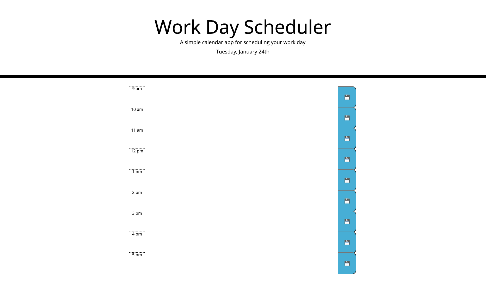

# Work-Day-Schedular
Calendar application for a Work Day Schedule.

## Description
(Work in progress. Currently deciding which is the best way for the textareas to be added to the html page.) 

This application when it is fully working, will show a day scheduler with hour slots. User can enter a text input within the hour slot that when saved, will store in local storage.
The time slots will show different colours depending on whether the hour time slot is in the past, present, or future.

## Built With 
* HTML
* CSS
* JavaScript ES6
* JQuery

## Screenshot

## Usage
You can view the work day scheduler [here]()

## Licence
Please refer to the LICENCE in the repository.